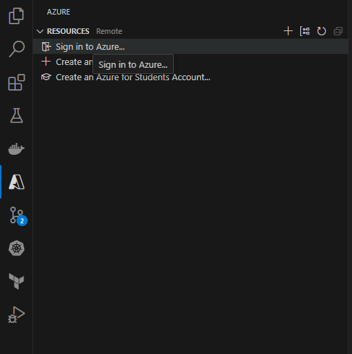
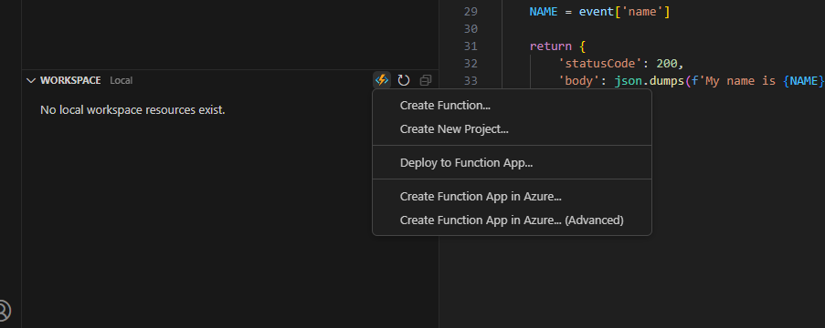
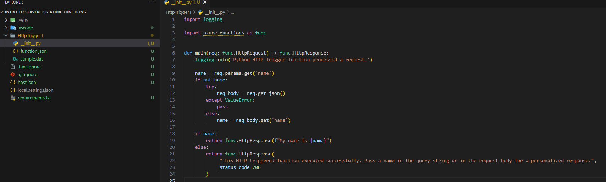
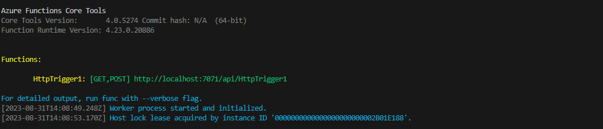
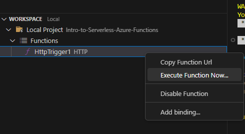
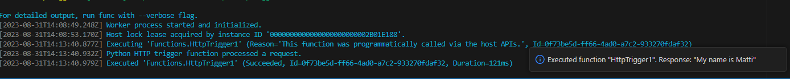

## **Intro to Serverless Azure Functions**
Serverless Cloud Functions on Microsoft Azure 

---


### **What is Azure Functions?**

```
Azure Functions is a serverless offering developed by Microsoft that means you can run code or containers in the cloud with no servers, billing is pay-as-you-go for the function as a service product. 
```
https://azure.microsoft.com/en-gb/products/functions#:~:text=Azure%20Functions%20is%20an%20event,highest%20level%20of%20hardware%20abstraction.

The USP of serverless functions:

- Pay per use model (measured in duration (ms))
- You don't mange the underlying servers as they are provisioned for you

Let's get started. 

First, you should have a Azure account and as a new customer, you can activate $200 in free credits to spend over 1 month. 

You will also need Visual Studio Code as the functions will be built and deployed from there.

**Visual Studio Code Extensions to install:**
- ms-azuretools.vscode-azurefunctions

Ok let's begin.


Click on the Azure Extension and sign into your account



Click 'Create Resource'.


Click 'Create Function'.



Then;

Select where you want all the files to go
Select the language you want to write the function in
Select a version from what's provided
Select HTTP Trigger
Function name: HttpTrigger1
Authorisation Level: Anonymous


The project will then be created.





Finally let's deploy this locally and test it.


## Run


To start the function locally, press F5 or the Run and Debug icon in the left-hand side Activity bar.


If your function is running locally then you should see a terminal that looks like the below image




## Test

In the Azure extension right click on the function trigger and Click 'Execute Function Now...'



Enter your input in the Visual Studio Code prompt


If successful you should see an output like the below.



Thanks for reading. 

---
<!-- DONE -->